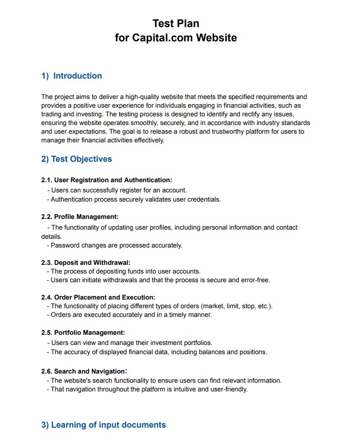
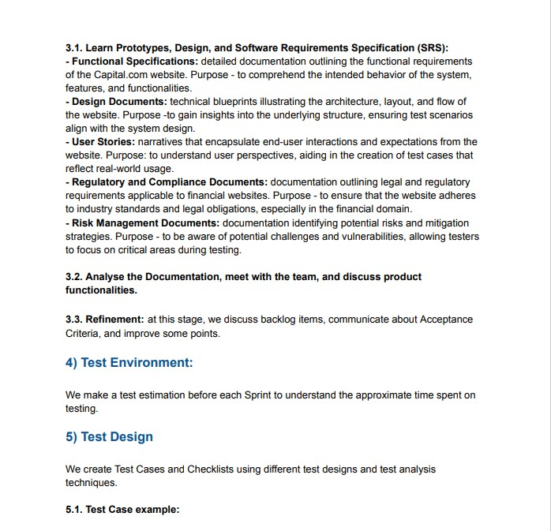
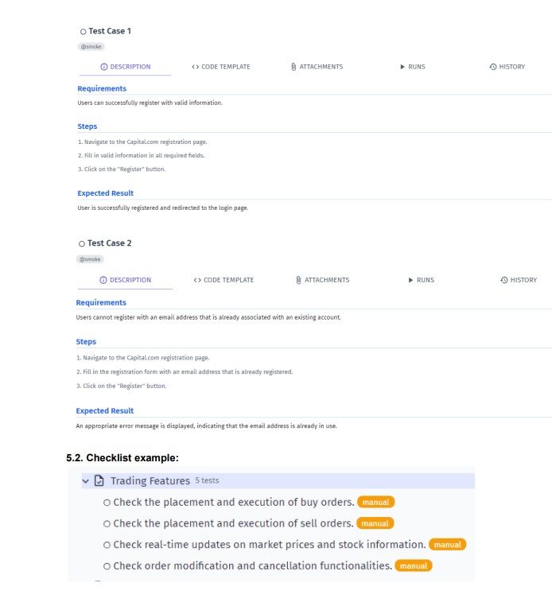
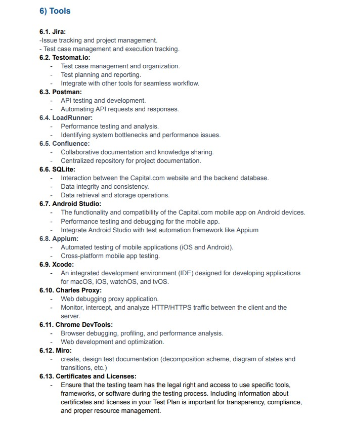
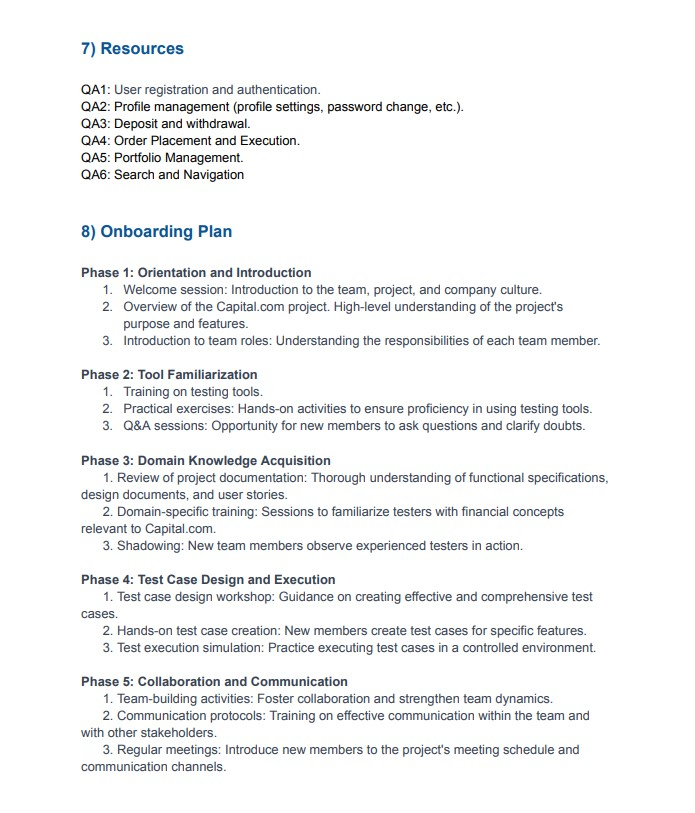
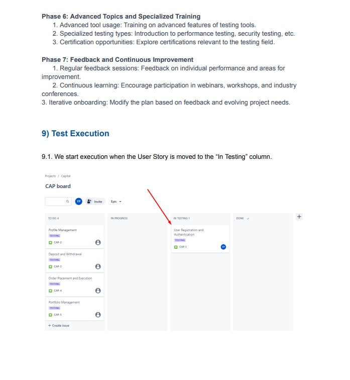
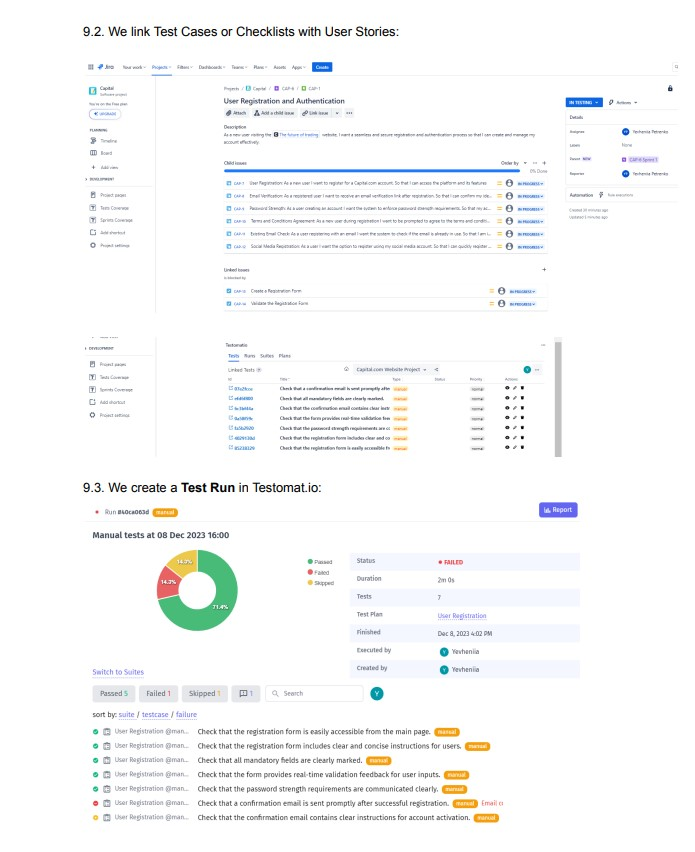
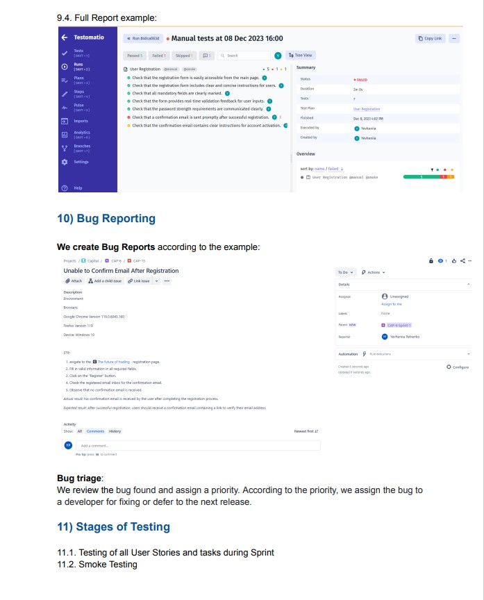
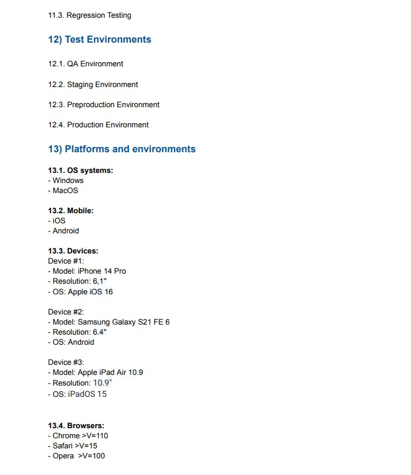
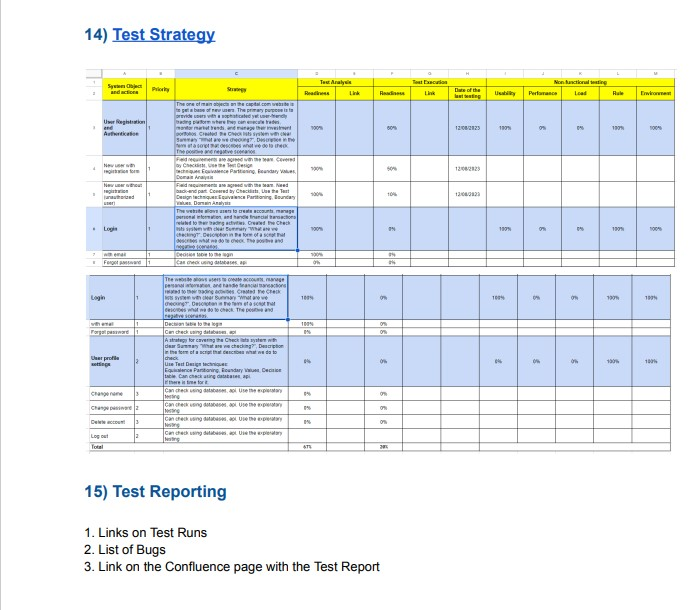

# Test_Plan
Test Plan document in software testing (sample template)

## Don't forget to give a :star: to make the project popular :) 

## :question: The task and what needs to be done?
- Write a Test Plan document  for any project. 
- Make it in an .pdf format.

## Test Plan
### A test plan is a detailed document that describes the testing strategy, goals, schedule, evaluation, results, and resources required to test a software product. A test plan helps to define the approaches required to verify the quality of the application under test. 

Test plans are important documents. They help to ensure that the team works in a coordinated manner. They act as a guide and ensure that the final product is bug-free and meets the expected requirements. They also help others who are not part of the team understand the testing process. One of the important aspects of test plans is that they can be constantly changing and vary from product to product.

The purpose of test plans
A test plan is a document that describes the entire scope of testing work, starting with a description of the test object, strategy, schedule, start and end criteria, to the equipment required in the process, special knowledge, and risk assessment with options for their solution.

### The test plan is intended for:

- regulation of testing processes;
- prioritization of tasks;
- resource planning;
- accounting for software and human resources.

### Test plan structure
As a rule, a test plan is drawn up by the QA leader of the testing team. But it can also be repeatedly edited by the testers themselves.

A quality test plan should at least consist of the following items:

### 1. What is to be tested?
In this paragraph, you need to describe the test object in detail. This can be a description of a system, application, or hardware. If the object of testing is an application, you should list all its functional blocks. It is also necessary to specify on what equipment and in which browsers the testing will be performed.

### 2. How will the testing be performed?
In this paragraph, you should describe the testing strategy in detail. It is necessary to list the types of testing and their application in relation to the test object.

### 3. When will the testing be conducted?
At this stage, the sequence of work is described: Test preparation, Testing, Test result analysis in the context of the planned development phases. Dates or criteria for moving from one phase to the next must be specified.

### 4. Criteria for starting testing
Depending on the specific project, the criteria for starting testing may vary. Examples of some possible options for starting testing are listed below:
- readiness of the test platform (testbed);
- completion of the development of the required functionality;
- availability of all necessary documentation.

### 5. Criteria for ending testing:
- requirements for the number of open bugs are met;
- a certain period of time without changing the source code of the program Code Freeze (CF);
- Zero Bug Bounce (ZBB): a certain period of time without opening new bugs;
- all tests have been successfully passed;
- all bugs with high and medium criticality are closed.

### If you answer all of these questions when creating a test plan, you will have a good draft of the test planning document. After that, you need to finalize it based on the points listed below, and the test plan will be almost ready:

- The environment of the system under test (description of the hardware and software);
- equipment and software required for testing (test bench and its configuration, automated testing programs, etc;)
- risks and ways to address them.

  A classic detailed test plan takes from a few pages to several dozen pages. However, its general structure is always preserved. 
### As a rule, a test plan has the following structure:

### 1st page:
- header (company logo and address);
- name of the test plan;
- version of the test plan;
- year.

### 2nd page:
Document history, which is a table of changes. This table contains the columns: date, version, description, author.

### Page 3:
The table of contents of the test plan.

### Page 4 and onwards:
introduction;
types of testing;
operating systems, browsers;
application functionality;
criteria for starting testing;
criteria for exiting the test;
equipment characteristics.

### Penultimate page:
how many man-hours are planned for different stages (start and end dates), e.g:
for test design;
test execution;
for test analysis;
for reports.

### The last page:
conclusions and recommendations.
The test plan may also include the following data: team of executors, contact details, bug life cycle, testing risks, references to documents or standards, glossary, schedule, responsibilities. You should pay special attention to risks. Risks can be associated with personnel-related shortcomings. For example, insufficient staff qualifications or insufficient number of testers.

A test plan is a significant element of the quality organization of the testing process, as it includes all the necessary and important information that describes the testing process. The creation of a test plan improves the quality of the product immeasurably by listing details and a list of checks, and also allows you to analyze how successfully all the stages of testing were carried out.

### :golf: The result:
Test Plan document for the capital .com website (sample template) was created 

  
  
  
  
  
  
  
  
  
  

